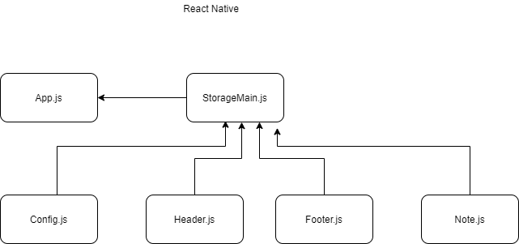

# React Native

## Todo App

### Author: Shubham Majumdar, Tammy Ip

### Links and Resources
* [submission PR](https://github.com/Shubham-401n16/Lab17---TCP-Server/pull/1)
* [Github Actions]()

#### Documentation
* [api docs](http://xyz.com/api-docs) (API servers)
* JSDoc Comment Required for all modules and functions in all .js files

### Setup
#### `.env` requirements (where applicable)
* `PORT` -
* `MONGODB_URI` -

#### How to initialize/run your server app (where applicable)
* `npm start`
* npm i -g expo-cli
* expo init contacts
* expo init app --template blank
* expo init --template blank
* expo build:ios
  
#### Tests
* How do you run tests?
npm test

#### UML

Reference -
https://www.youtube.com/watch?v=xb8uTN3qiUI
